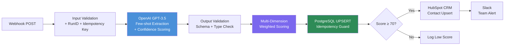
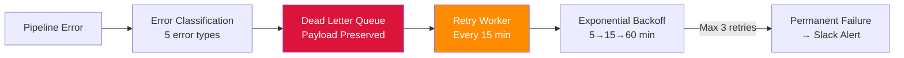

# AI-First GTM Lead Processing System

**An end-to-end AI-powered sales lead processing pipeline** that automatically captures, extracts, scores, and routes high-quality leads through an intelligent multi-stage workflow.

Built with: **n8n** | **OpenAI GPT-3.5** | **PostgreSQL 16** | **HubSpot CRM** | **Slack** | **Docker**

---

## Architecture



**Error Recovery Pipeline:**



---

## Results & Metrics

| Metric | Value | How |
|--------|-------|-----|
| **Deduplication Hit Rate** | 100% on repeated submissions | SHA256 idempotency key on normalized text; PostgreSQL `ON CONFLICT` guarantees zero duplicates |
| **DLQ Recovery Rate** | Up to 100% for transient errors | Exponential backoff retry (5→15→60 min), max 3 attempts; validation errors skipped (0 retries) |
| **End-to-End Latency** | ~2-3s per lead | Webhook → AI extraction → DB write → CRM sync → Slack notification |

---

## Key Technical Highlights

### 1. AI Prompt Engineering — Few-Shot with Confidence Scoring

Not just a simple "extract these fields" prompt. The system uses:
- **Few-shot examples** (2 demonstrations) to anchor output format
- **Per-field confidence scores** (0.0–1.0) so downstream logic knows how reliable each extraction is
- **Analysis summary** — a one-line reasoning note (not verbose chain-of-thought) explaining extraction quality
- **Schema-constrained JSON** output with strict type enforcement

```json
{
  "company": "Acme Technologies Inc.",
  "contact_name": "Sarah Chen",
  "email": "sarah@acmetech.com",
  "budget": "$75K",
  "urgency": "Need to start within two weeks",
  "analysis_summary": "High-quality lead: company, contact, email, clear budget and urgent timeline",
  "confidence": { "company": 1.0, "contact_name": 1.0, "email": 1.0, "budget": 0.9, "urgency": 0.9 }
}
```

### 2. Multi-Dimension Weighted Scoring

Leads are scored across 5 weighted dimensions, not just keyword matching:

| Dimension | Weight | Scoring Logic |
|-----------|--------|--------------|
| Budget | 30% | Has amount keyword → 100; has info → 60; none → 0 |
| Urgency | 20% | Immediate (days/weeks/ASAP) → 100; medium (months/quarterly) → 70; has info → 50 |
| Contact Info | 20% | Email → +60; Name → +40 |
| Company | 15% | Present → 100; absent → 0 |
| AI Confidence | 15% | Average confidence across all fields × 100 |

Each lead includes a `score_breakdown` object for full audit trail.

### 3. Idempotency — SHA256 Deduplication

Every lead text is normalized (lowercase, whitespace-collapsed, punctuation-standardized) and hashed. The same lead submitted twice produces the same `idempotency_key`, triggering PostgreSQL's `ON CONFLICT → UPDATE` instead of a duplicate insert.

### 4. Dead Letter Queue with Exponential Backoff

Failed leads aren't lost — they're captured in a DLQ with the full original payload:

| Error Type | Max Retries | Backoff Schedule |
|------------|-------------|------------------|
| `ai_error` | 3 | 5 min → 15 min → 60 min |
| `db_error` | 3 | 5 min → 15 min → 60 min |
| `slack_error` | 2 | 5 min → 15 min |
| `validation_error` | 0 | No retry (bad input) |
| `unknown` | 1 | 5 min |

A background worker runs every 15 minutes to process pending retries.

### 5. Event Sourcing for Audit Trail

Every pipeline step writes to an `events` table with a `run_id` for end-to-end tracing. You can reconstruct the full lifecycle of any lead:

```sql
SELECT step, status, created_at FROM events WHERE run_id = 'abc123' ORDER BY created_at;
```

---

## Tech Stack

| Layer | Technology | Why This Choice |
|-------|-----------|-----------------|
| Orchestration | **n8n** | Visual workflow builder; self-hosted for data control |
| AI | **OpenAI GPT-3.5 Turbo** | Best cost/quality ratio for structured extraction |
| Database | **PostgreSQL 16** | JSONB for flexible data, UPSERT for idempotency |
| CRM | **HubSpot** | Industry-standard CRM with robust API |
| Notifications | **Slack Webhooks** | Real-time team alerts with zero setup |
| Infrastructure | **Docker Compose** | One-command local deployment |

---

## Quick Start

### Prerequisites

- Docker & Docker Compose
- OpenAI API key
- HubSpot Private App token
- Slack Incoming Webhook URL

### 1. Clone & Configure

```bash
git clone https://github.com/Zey-Z/ai-gtm-system.git
cd ai-gtm-system
cp .env.example .env
# Edit .env with your API keys
```

### 2. Start Services

```bash
docker-compose up -d
# PostgreSQL → port 5432, n8n → port 5678
```

### 3. Import Workflows

Open `http://localhost:5678`, import these 3 workflow files:
- `workflows/AI-Lead-Extractor-v1.json` — Main pipeline
- `workflows/DLQ-Retry-Worker.json` — Background retry worker
- `workflows/Error-Handler.json` — Error classification & DLQ routing

### 4. Test

```bash
curl -X POST http://localhost:5678/webhook/lead-intake \
  -H "Content-Type: application/json" \
  -d '{
    "lead_text": "Hi, I am Sarah Chen from TechStartup Inc. Email: sarah@techstartup.com. We have a budget of $75K and need to start within two weeks."
  }'
```

Expected: AI extracts all 5 fields with high confidence → score ≥ 70 → syncs to HubSpot → Slack notification sent.

---

## Project Structure

```
ai-gtm-system/
├── workflows/
│   ├── AI-Lead-Extractor-v1.json    # Main pipeline (11 nodes)
│   ├── DLQ-Retry-Worker.json        # Background retry (11 nodes)
│   └── Error-Handler.json           # Error classification (8 nodes)
├── db/
│   ├── init.sql                     # Base schema (leads + events)
│   ├── dlq-queries.sql              # Monitoring queries
│   └── migrations/
│       ├── 001_add_run_id.sql       # Distributed tracing
│       ├── 002_create_dlq.sql       # Dead Letter Queue
│       └── 003_add_idempotency.sql  # SHA256 deduplication
├── docs/
│   ├── architecture.md              # System design & decisions
│   ├── prompt-engineering.md        # AI prompt design rationale
│   ├── dlq-operations.md            # DLQ monitoring & operations
│   └── ...                          # Setup guides
├── tests/
│   ├── test-webhook.ps1             # End-to-end webhook tests
│   ├── test-scoring.js              # Scoring algorithm unit tests
│   └── test-queries.sql             # Database verification queries
├── docker-compose.yml               # PostgreSQL + n8n
├── .env.example                     # Required environment variables
└── README.md
```

---

## System Design Decisions

| Decision | Choice | Rationale |
|----------|--------|-----------|
| Workflow engine | n8n (self-hosted) | Full data control, no vendor lock-in, visual debugging |
| AI model | GPT-3.5 Turbo | Sufficient accuracy for structured extraction at 10× lower cost than GPT-4 |
| Prompt strategy | Few-shot + confidence | More reliable than zero-shot; confidence enables downstream quality gates |
| Scoring | Rule-based weighted | Transparent, auditable, tunable; ML-based scoring planned for v2 |
| Error recovery | DLQ + exponential backoff | Industry-standard pattern for resilient async processing |
| Idempotency | Content hash (not request ID) | Same lead text = same key, regardless of submission source |
| Database | PostgreSQL UPSERT | Atomic create-or-update in single query; no race conditions |

---

## Documentation

- [Architecture & Design](docs/architecture.md)
- [Prompt Engineering Rationale](docs/prompt-engineering.md)

---

## License

MIT
