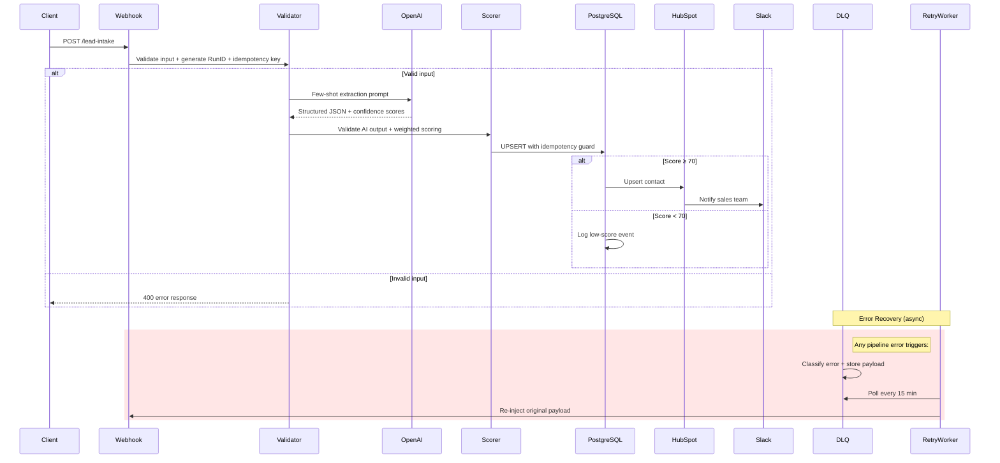
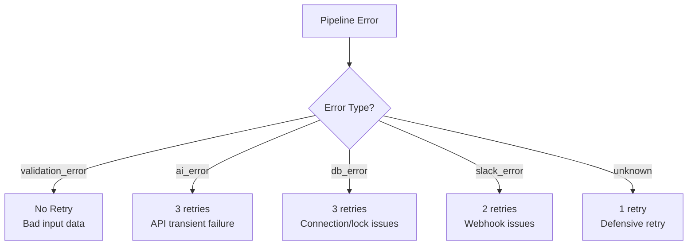

# Architecture & System Design

## Overview

This system processes unstructured sales lead text into structured, scored, CRM-ready data through a multi-stage AI pipeline with built-in resilience.

## Data Flow



## Pipeline Stages

### Stage 1: Input Validation & Identity Generation

**Node:** `1.5-Validate-Input-Generate-RunID`

Three identifiers are generated for every request:

| Identifier | Purpose | Generation Method |
|-----------|---------|-------------------|
| `run_id` | End-to-end tracing | n8n execution ID |
| `external_id` | Business key | `lead_{timestamp}_{random}` |
| `idempotency_key` | Deduplication | DJB2 hash of normalized text |

**Text normalization** before hashing: lowercase → collapse whitespace → standardize punctuation. This ensures "Hello World" and "hello  world" produce the same key.

### Stage 2: AI Extraction

**Node:** `2-AI-Extract-Info`

| Parameter | Value | Rationale |
|-----------|-------|-----------|
| Model | GPT-3.5 Turbo | Best cost/quality for structured extraction |
| Temperature | 0.1 | Low randomness for deterministic outputs |
| Output format | JSON object | Enforced by n8n OpenAI node |
| Prompt style | Few-shot (2 examples) | More reliable than zero-shot |

The AI returns 5 data fields + `analysis_summary` + per-field `confidence` scores.

See [Prompt Engineering](prompt-engineering.md) for detailed design rationale.

### Stage 3: Output Validation

**Node:** `2.5-Validate-AI-Output`

Multi-layer validation:
1. **Field type check** — All data fields must be `string | null`
2. **Email format** — Regex validation if email is present
3. **Confidence range** — Each score must be in `[0.0, 1.0]`
4. **Completeness check** — Warning if <2 fields extracted
5. **Score penalty** — Validation issues reduce the final lead score

### Stage 4: Multi-Dimension Scoring

**Node:** `3-Prepare-Data`

Five dimensions with configurable weights:

```
Final Score = Σ (dimension_score × weight) - validation_penalty
```

Every lead includes a `score_breakdown` object recording each dimension's raw score, weight, and weighted contribution. This enables:
- **Audit trail** — Why did this lead get 85 points?
- **Tuning** — Which dimension needs adjustment?
- **Analytics** — Which dimension contributes most to high-scoring leads?

### Stage 5: Database Write

**Node:** `4-Write-to-Database`

Uses PostgreSQL `INSERT ... ON CONFLICT (idempotency_key) DO UPDATE`:
- First submission → INSERT (new record)
- Duplicate submission → UPDATE (merge latest data)
- Already processed → Status preserved via `CASE WHEN`

### Stage 6: Conditional Routing

Leads with score ≥ 70 proceed to HubSpot + Slack. Lower scores are logged but not synced.

**Why 70?** Based on scoring weights: a lead needs at least 3 out of 5 dimensions filled with meaningful data to cross this threshold.

## Error Recovery Architecture

### Error Classification

The Error Handler workflow categorizes failures into 5 types, each with different retry strategies:



### DLQ Retry Worker

Runs on a 15-minute schedule:
1. Query `dead_letter_queue` for records where `status = 'pending'` and `next_retry_at <= NOW()`
2. Mark as `retrying` (optimistic lock)
3. Re-inject original payload to webhook
4. On success → mark `resolved`
5. On failure → increment `retry_count`, calculate next backoff, update `next_retry_at`
6. If `retry_count >= max_retries` → mark `failed_permanently` + Slack alert

### Exponential Backoff

```
Retry 1: +5 minutes
Retry 2: +15 minutes
Retry 3: +60 minutes
```

This prevents overwhelming a recovering service while still attempting recovery promptly.

## Database Design

### Three core tables:

| Table | Purpose | Key Features |
|-------|---------|-------------|
| `leads` | Lead records | UPSERT, idempotency, scoring |
| `events` | Audit log | Event sourcing, run_id tracing |
| `dead_letter_queue` | Failed records | Retry state machine, payload preservation |

### Index Strategy

- `idx_leads_idempotency_key` (UNIQUE) — O(1) duplicate detection
- `idx_dlq_status` + partial index on `pending` — Fast retry worker queries
- `idx_events_run_id` — Fast trace reconstruction

## Scalability Considerations

| Aspect | Current (MVP) | Production Path |
|--------|---------------|-----------------|
| Throughput | Sequential processing | Parallel webhook workers, batch DB writes |
| AI Model | GPT-3.5 single call | Model routing (simple → GPT-3.5, complex → GPT-4) |
| Scoring | Rule-based weighted | ML model trained on conversion data |
| Monitoring | SQL queries + Slack alerts | Grafana dashboard + PagerDuty |
| Deployment | Docker Compose (local) | Kubernetes + managed PostgreSQL |
